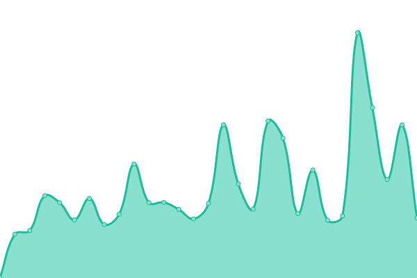
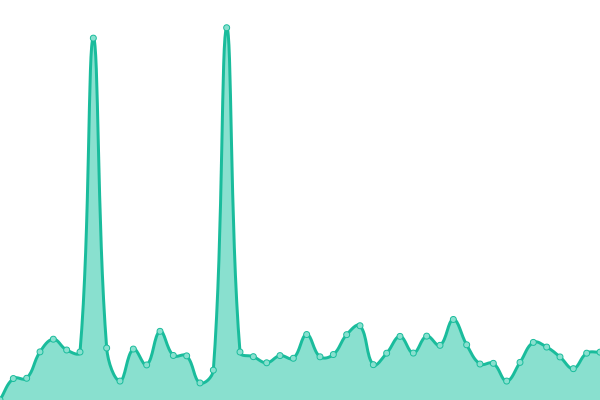
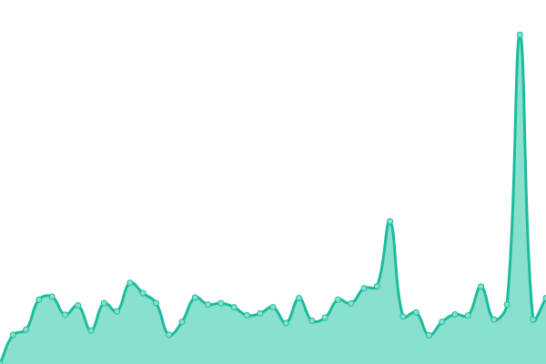

# [📈 Live Status](https://status.revi.me): <!--live status--> **🟧 Partial outage**

This repository contains the open-source uptime monitor and status page for [Revinet Status Pages](https://status.revi.me), powered by [Upptime](https://github.com/upptime/upptime).

With [Upptime](https://upptime.js.org), you can get your own unlimited and free uptime monitor and status page, powered entirely by a GitHub repository. We use [Issues](https://github.com/revinet-status/upptime/issues) as incident reports, [Actions](https://github.com/revinet-status/upptime/actions) as uptime monitors, and [Pages](https://status.revi.me) for the status page.

<!--start: status pages-->
<!-- This summary is generated by Upptime (https://github.com/upptime/upptime) -->
<!-- Do not edit this manually, your changes will be overwritten -->
<!-- prettier-ignore -->
| URL | Status | History | Response Time | Uptime |
| --- | ------ | ------- | ------------- | ------ |
|  [Main Page](https://revi.xyz/) | 🟩 Up | [main-page.yml](https://github.com/revinet-status/upptime/commits/HEAD/history/main-page.yml) | 

 155ms
     
 | 

<a href="https://status.revi.me/history/main-page">100.00%</a>
    

|  [ReviPhab](https://issuetracker.revi.xyz/status/) | 🟩 Up | [revi-phab.yml](https://github.com/revinet-status/upptime/commits/HEAD/history/revi-phab.yml) | 

 350ms
     
 | 

<a href="https://status.revi.me/history/revi-phab">100.00%</a>
    

|  [Blog (by omg.lol)](https://revi.blog/P86) | 🟥 Down | [blog-by-omg-lol.yml](https://github.com/revinet-status/upptime/commits/HEAD/history/blog-by-omg-lol.yml) | 

 231ms
     
 | 

<a href="https://status.revi.me/history/blog-by-omg-lol">0.00%</a>
    

|  [Fastmail](https://app.fastmail.com/) | 🟩 Up | [fastmail.yml](https://github.com/revinet-status/upptime/commits/HEAD/history/fastmail.yml) | 

 184ms
     
 | 

<a href="https://status.revi.me/history/fastmail">100.00%</a>
    

|  [Firefly 3](https://ff3.revi.xyz/login) | 🟩 Up | [firefly-3.yml](https://github.com/revinet-status/upptime/commits/HEAD/history/firefly-3.yml) | 

 214ms
     
 | 

<a href="https://status.revi.me/history/firefly-3">100.00%</a>
    

|  [git.silicon.moe](https://git.silicon.moe/revi/dots/commit/7a987ba1a7625052a50d9c7c87dcc89de562e931) | 🟩 Up | [git-silicon-moe.yml](https://github.com/revinet-status/upptime/commits/HEAD/history/git-silicon-moe.yml) | 

 895ms
     
 | 

<a href="https://status.revi.me/history/git-silicon-moe">99.92%</a>
    

|  [GnuPG Key Repository](https://k.revi.xyz/0xBEFF197A.asc) | 🟩 Up | [gnu-pg-key-repository.yml](https://github.com/revinet-status/upptime/commits/HEAD/history/gnu-pg-key-repository.yml) | 

 882ms
     
 | 

<a href="https://status.revi.me/history/gnu-pg-key-repository">100.00%</a>
    

|  Google Calendar RSVP | 🟩 Up | [google-calendar-rsvp.yml](https://github.com/revinet-status/upptime/commits/HEAD/history/google-calendar-rsvp.yml) | 

 218ms
     
 | 

<a href="https://status.revi.me/history/google-calendar-rsvp">100.00%</a>
    

|  [Listed.To (note distributor)](https://listed.to/p/wrEd7iVigI) | 🟩 Up | [listed-to-note-distributor.yml](https://github.com/revinet-status/upptime/commits/HEAD/history/listed-to-note-distributor.yml) | 

 495ms
     
 | 

<a href="https://status.revi.me/history/listed-to-note-distributor">99.76%</a>
    

|  [Migadu](https://admin.migadu.com/public/login) | 🟩 Up | [migadu.yml](https://github.com/revinet-status/upptime/commits/HEAD/history/migadu.yml) | 

 537ms
     
 | 

<a href="https://status.revi.me/history/migadu">100.00%</a>
    

|  [Postmark](https://api.postmarkapp.com/senders?count=50&offset=0) | 🟩 Up | [postmark.yml](https://github.com/revinet-status/upptime/commits/HEAD/history/postmark.yml) | 

 161ms
     
 | 

<a href="https://status.revi.me/history/postmark">100.00%</a>
    

|  [Old Sharlayan](https://old.sharlayan.city/nodeinfo/2.0) | 🟩 Up | [old-sharlayan.yml](https://github.com/revinet-status/upptime/commits/HEAD/history/old-sharlayan.yml) | 

 504ms
     
 | 

<a href="https://status.revi.me/history/old-sharlayan">99.87%</a>
    

|  [PasteBin (by omg.lol)](https://paste.revi.xyz/temp20230711-1/raw) | 🟥 Down | [paste-bin-by-omg-lol.yml](https://github.com/revinet-status/upptime/commits/HEAD/history/paste-bin-by-omg-lol.yml) | 

 491ms
     
 | 

<a href="https://status.revi.me/history/paste-bin-by-omg-lol">98.87%</a>
    

|  [Tailscale](https://login.tailscale.com/login) | 🟩 Up | [tailscale.yml](https://github.com/revinet-status/upptime/commits/HEAD/history/tailscale.yml) | 

 645ms
     
 | 

<a href="https://status.revi.me/history/tailscale">99.77%</a>
    

|  [Todoist](https://app.todoist.com/auth/login) | 🟩 Up | [todoist.yml](https://github.com/revinet-status/upptime/commits/HEAD/history/todoist.yml) | 

 166ms
     
 | 

<a href="https://status.revi.me/history/todoist">100.00%</a>
    

|  [Traccar](https://traccar.revi.xyz/) | 🟩 Up | [traccar.yml](https://github.com/revinet-status/upptime/commits/HEAD/history/traccar.yml) | 

 385ms
     
 | 

<a href="https://status.revi.me/history/traccar">100.00%</a>
    

|  [URL Shortener (by omg.lol)](https://revi.kr/discord/wut) | 🟥 Down | [url-shortener-by-omg-lol.yml](https://github.com/revinet-status/upptime/commits/HEAD/history/url-shortener-by-omg-lol.yml) | 

 385ms
     
 | 

<a href="https://status.revi.me/history/url-shortener-by-omg-lol">98.99%</a>
    

|  [Wiki (by Miraheze)](https://revi.wiki/w/api.php?action=query&meta=siteinfo&siprop=statistics&format=json) | 🟩 Up | [wiki-by-miraheze.yml](https://github.com/revinet-status/upptime/commits/HEAD/history/wiki-by-miraheze.yml) | 

 518ms
     
 | 

<a href="https://status.revi.me/history/wiki-by-miraheze">100.00%</a>
    

|  [Old Blog (by Tistory)](https://tistory.revi.blog/) | 🟩 Up | [old-blog-by-tistory.yml](https://github.com/revinet-status/upptime/commits/HEAD/history/old-blog-by-tistory.yml) | 

 2003ms
     
 | 

<a href="https://status.revi.me/history/old-blog-by-tistory">100.00%</a>
    

|  [ShinhanCard](https://www.shinhancard.com/) | 🟩 Up | [shinhan-card.yml](https://github.com/revinet-status/upptime/commits/HEAD/history/shinhan-card.yml) | 

 1862ms
     
 | 

<a href="https://status.revi.me/history/shinhan-card">100.00%</a>
    

|  [HyundaiCard](https://www.hyundaicard.com/) | 🟩 Up | [hyundai-card.yml](https://github.com/revinet-status/upptime/commits/HEAD/history/hyundai-card.yml) | 

 1962ms
     
 | 

<a href="https://status.revi.me/history/hyundai-card">100.00%</a>
    

<!--end: status pages-->

[**Visit our status website →**](https://status.revi.me)

## 📄 License

- Powered by: [Upptime](https://github.com/upptime/upptime)
- Code: [MIT](./LICENSE) © [Revinet Status Pages](https://status.revi.me)
- Data in the `./history` directory: [Open Database License](https://opendatacommons.org/licenses/odbl/1-0/)
